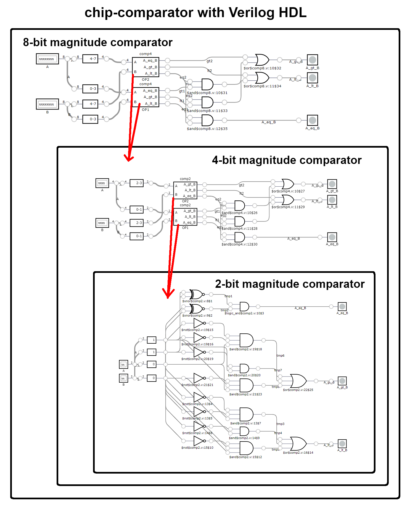

#  Chip Comparator

## A 4-bit magnitude cascade comparator chip

#

<p align="center">
    <a href="https://github.com/ericxlima/chip-comparator/blob/main/chip.png">
        
    </a>
</p>

#
### To Use:
```sh
#  Icarus Verilog Compiler Installation (Linux)
sudo apt-get update
sudo apt-get install iverilog

#  GTKWave Viewer Installation (Linux)
sudo apt update
sudo apt install gtkwave

#  Clonning this repository
git clone https://github.com/ericxlima/chip-comparator.git
cd chip-comparator

#  Compile
iverilog -o dsys systemx_tb.v systemx.v
vvp dsys
```

> Use the [GTKWave](http://gtkwave.sourceforge.net/) or some extension in your IDE to visualizer the waves in this file `systemx_tb.vcd`.

#
### Directory Map
```text
chip-comparator/
│
├── .vscode/
│   └── settings.json
│
├── steps/
│   │
│   ├── Q1/
│   │   ├── README.md
│   │   ├── dsys
│   │   ├── systemx.v
│   │   └── systemx_tb.v
│   │
│   ├── Q2/
│   │   ├── dsys
│   │   ├── systemx.v
│   │   ├── systemx_tb.v
│   │   └── systemx_tb.vcd
│   │
│   ├── Q3/
│   │   │
│   │   ├── a/
│   │   │   ├── dsys
│   │   │   ├── systemx.v
│   │   │   ├── systemx_tb.v
│   │   │   └── systemx_tb.vcd
│   │   │
│   │   ├── b/
│   │   │   ├── dsys
│   │   │   ├── systemx.v
│   │   │   ├── systemx_tb.v
│   │   │   └── systemx_tb.vcd
│   │   │
│   │   └── c/
│   │       ├── dsys
│   │       ├── systemx.v
│   │       ├── systemx_tb.v
│   │       └── systemx_tb.vcd
│   │
│   ├── Q4/
│   │   │
│   │   ├── a/
│   │   │   ├── system_1.v
│   │   │   └── system_2.v
│   │   │
│   │   └── b/
│   │       ├── README.md
│   │       └── system_3.v
│   │
│   └── Q5/
│       │
│       ├── comp2/
│       │   ├── comp2.v
│       │   ├── comp2_tb.v
│       │   ├── comp2_tb.vcd
│       │   └── dsys
│       │
│       ├── comp4/
│       │   ├── comp4.v
│       │   ├── comp4_tb.v
│       │   ├── comp4_tb.vcd
│       │   └── dsys
│       │
│       └── comp8/
│           ├── comp8.v
│           └── comp8_tb.v
│
├── chip.png
└── README.md
```

##  Authors 👥
| <a href="https://github.com/ericxlima"></a> | <a href="https://github.com/OnLeonidas"></a> |
| :----: | :----: |
| [Eric de Lima](https://github.com/ericxlima) | [Michel Leonidas](https://github.com/OnLeonidas) |
